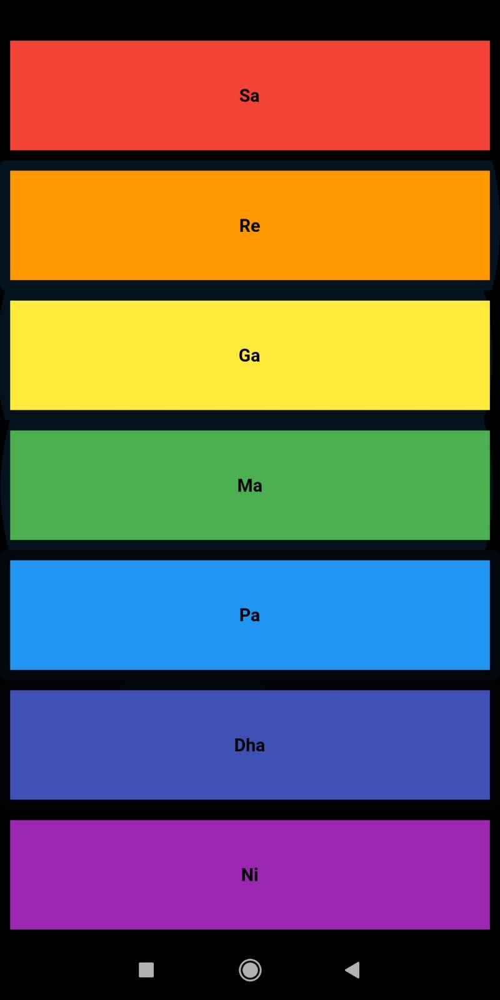
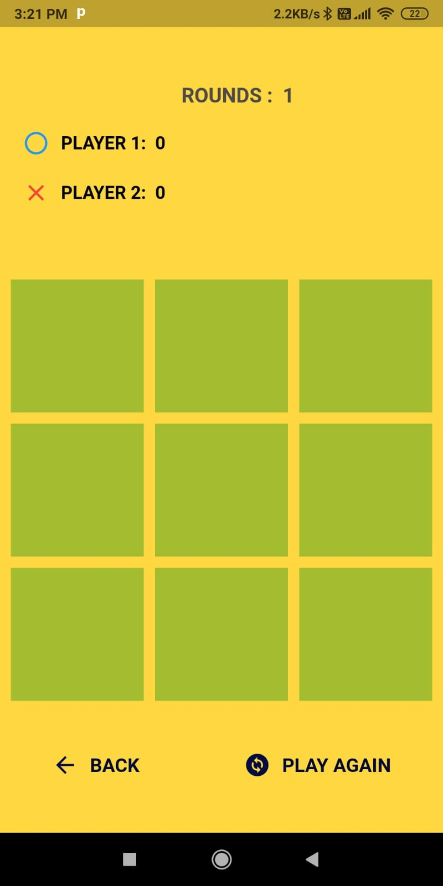
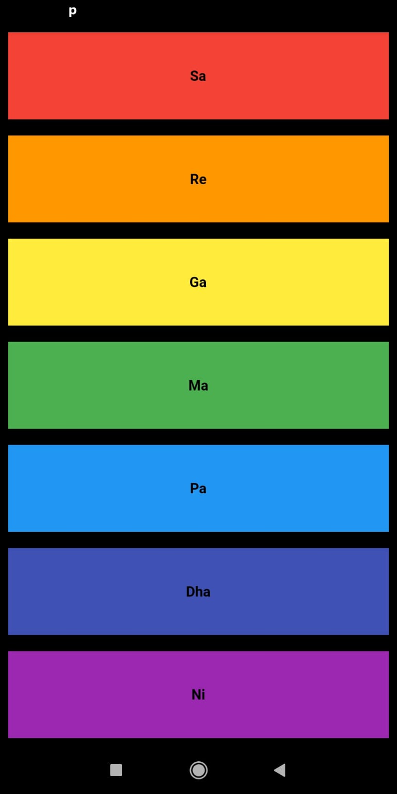
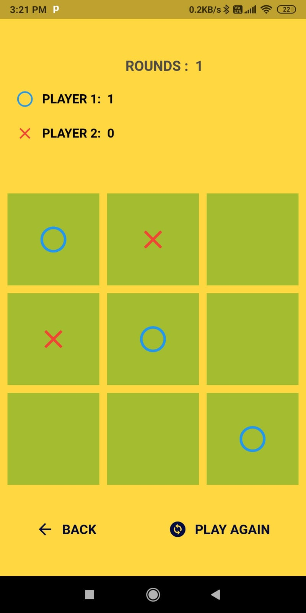

# Many Games

**A versatile collection of fun games for Android**

Explore a world of entertainment with Many Games, a Flutter project that offers a range of engaging and interactive games for Android users.

## Platform

- Tested and optimized for Android

## Get the APK
- **[Download APK](https://drive.google.com/file/d/1dxooN29NDlHZgFGzAv8jqmmlXs1PDns2/view?usp=sharing)**

## Screenshots 
<table>
  <tr>
    <td>
      
    </td>
    <td style="padding-left: 20px;">
      
    </td>
    <td style="padding-left: 20px;">
      
    </td>
    <td style="padding-left: 20px;">
      
    </td>
    <td style="padding-left: 20px;">
      
    </td>
    <td style="padding-left: 20px;">
      
    </td>
  </tr>
</table>

## About

### Tic Tac Toe

Enjoy a classic game of Tic Tac Toe with a twist! Challenge your friends or family to a two-player showdown in offline mode.

### Xylophone

Discover the joy of music with our Xylophone game. Featuring seven melodious nodes (SA, RE, GA, MA, PA, DHA, NI), you can create beautiful melodies and tunes to your heart's content.
